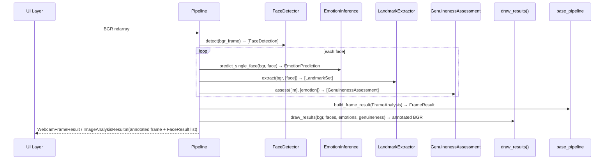

# Facial Emotions — Architecture

## System Architecture Diagram

```mermaid
graph TB
    %% ─────────────────────────────────────────────────────────
    %% Entry Point
    %% ─────────────────────────────────────────────────────────
    subgraph entry["Entry Point"]
        APP["app.py\n─────────────\nmain()\n_ProactorNoiseFilter"]
    end

    %% ─────────────────────────────────────────────────────────
    %% UI Layer
    %% ─────────────────────────────────────────────────────────
    subgraph ui["UI Layer  (gradio_app.py)"]
        IMG_TAB["Image Tab\n─────────────\nanalyse_image()"]
        VID_TAB["Video Tab\n─────────────\nanalyse_video()"]
        CAM_TAB["Webcam Tab\n─────────────\nanalyse_webcam_frame()\ngr.State (last frame)"]
    end

    %% ─────────────────────────────────────────────────────────
    %% Pipeline Layer
    %% ─────────────────────────────────────────────────────────
    subgraph pipelines["Pipeline Layer"]
        IMG_PIPE["ImageAnalysisPipeline\n─────────────\nanalyse(bgr_image)\n_remap_detections()"]
        VID_PIPE["VideoAnalysisPipeline\n─────────────\nanalyse(video_path)\n_read_sampled_frames()\n_process_frame()"]
        CAM_PIPE["WebcamAnalysisPipeline\n─────────────\nanalyse_frame(bgr_frame)"]
        BASE["base_pipeline.py\n─────────────\nbuild_face_result()\nbuild_frame_result()"]
    end

    %% ─────────────────────────────────────────────────────────
    %% Service Layer
    %% ─────────────────────────────────────────────────────────
    subgraph services["Service Layer"]
        FACE_DET["FaceDetector\n─────────────\nOpenCV Haar Cascade\nhaarcascade_frontalface_alt2\nequalizeHist → detectMultiScale"]
        EMOTION["EmotionInferenceService\n─────────────\nONNX Runtime\nFER+ model (7 classes)\npredict_single_face()"]
        LANDMARK["LandmarkExtractor\n─────────────\nMediaPipe (optional)\nor geometry fallback\nextract() → LandmarkSet"]
        GENUINE["GenuinenessAssessmentService\n─────────────\nRule-based heuristics\n(EAR, mouth curvature,\nsmile symmetry)\nassess() → GenuinenessAssessment"]
        OVERLAY["draw_results()\n─────────────\nOpenCV drawing\nbbox + emotion label\n+ genuineness state"]
        MEDIA_IO["media_io.py\n─────────────\nvalidate_image_dimensions()\ndownscale_to_processing_ceiling()\nopen_video_capture()"]
    end

    %% ─────────────────────────────────────────────────────────
    %% Domain Layer
    %% ─────────────────────────────────────────────────────────
    subgraph domain["Domain Layer"]
        MODELS["domain/models.py\n─────────────\nFaceDetection\nLandmarkSet\nEmotionPrediction\nGenuinenessAssessment\nFrameAnalysis\nAnalysisRequest"]
        ENUMS["domain/enums.py\n─────────────\nEmotionLabel (7)\nGenuinenessState (3)\nInputMode / MediaType"]
    end

    %% ─────────────────────────────────────────────────────────
    %% Contract Layer
    %% ─────────────────────────────────────────────────────────
    subgraph contracts["Contract Layer  (serialisable results)"]
        RESULTS["contracts/results.py\n─────────────\nFaceResult\nFrameResult\nImageAnalysisResult\nVideoAnalysisResult\nWebcamFrameResult"]
    end

    %% ─────────────────────────────────────────────────────────
    %% Config
    %% ─────────────────────────────────────────────────────────
    subgraph cfg["Config"]
        CONFIG["config.py\n─────────────\nMODELS_DIR / ASSETS_DIR\nMAX_FACES\nIMAGE_MIN_SIDE\nIMAGE_PROCESSING_CEILING\nIMAGE_REJECTION_CEILING\nWEBCAM_FRAME_BUDGET_MS\nVIDEO_SAMPLE_FPS"]
    end

    %% ─────────────────────────────────────────────────────────
    %% External Models / Resources
    %% ─────────────────────────────────────────────────────────
    subgraph external["External Models & Resources"]
        ONNX["FER+ ONNX Model\nmodels/emotion/\nfacial_expression_model.onnx"]
        CASCADE["Haar Cascade XML\n(bundled with OpenCV)"]
        MP_MODEL["MediaPipe BlazeFace Task\nmodels/face_detection/\n(optional — auto-skipped)"]
    end

    %% ─────────────────────────────────────────────────────────
    %% Flow connections
    %% ─────────────────────────────────────────────────────────

    APP --> ui

    IMG_TAB -->|"PIL Image → BGR ndarray"| IMG_PIPE
    VID_TAB -->|"filepath (copied to tmp)"| VID_PIPE
    CAM_TAB -->|"RGB ndarray → BGR"| CAM_PIPE

    IMG_PIPE --> FACE_DET
    IMG_PIPE --> EMOTION
    IMG_PIPE --> LANDMARK
    IMG_PIPE --> GENUINE
    IMG_PIPE --> OVERLAY
    IMG_PIPE --> BASE

    VID_PIPE -->|"cv2.VideoCapture\nsampled frames"| FACE_DET
    VID_PIPE --> EMOTION
    VID_PIPE --> LANDMARK
    VID_PIPE --> GENUINE
    VID_PIPE --> OVERLAY
    VID_PIPE --> BASE

    CAM_PIPE --> FACE_DET
    CAM_PIPE --> EMOTION
    CAM_PIPE --> LANDMARK
    CAM_PIPE --> GENUINE
    CAM_PIPE --> OVERLAY
    CAM_PIPE --> BASE

    BASE --> MODELS
    BASE --> RESULTS

    FACE_DET --> CASCADE
    EMOTION --> ONNX
    LANDMARK --> MP_MODEL

    FACE_DET --> MODELS
    EMOTION --> MODELS
    LANDMARK --> MODELS
    GENUINE --> MODELS

    IMG_PIPE --> RESULTS
    VID_PIPE --> RESULTS
    CAM_PIPE --> RESULTS

    IMG_TAB -->|"validate + downscale"| MEDIA_IO
    VID_TAB -->|"copy + open"| MEDIA_IO

    MODELS --> ENUMS
    GENUINE --> ENUMS

    FACE_DET --> CONFIG
    EMOTION --> CONFIG
    LANDMARK --> CONFIG
    MEDIA_IO --> CONFIG
```

---

## Layer Responsibilities

| Layer | Responsibility |
|---|---|
| **Entry Point** (`app.py`) | Configures logging, silences Windows asyncio noise, launches Gradio |
| **UI** (`gradio_app.py`) | Gradio Blocks UI — Image / Video / Webcam tabs; RGB↔BGR conversion; gr.State for webcam persistence |
| **Pipelines** | Orchestrate the service calls for each input mode; assemble domain objects; call `build_frame_result` |
| **Services** | Single-responsibility components — detection, inference, landmarks, genuineness, rendering |
| **Domain** | Pure data models and enums — no I/O, no framework dependencies |
| **Contracts** | Serialisable output DTOs returned to the UI and tests |
| **Config** | Environment-overridable constants — model paths, size ceilings, timeouts |

---

## Data Flow — Per Frame

---

## Key Design Decisions

- **No ffmpeg dependency** — `gr.Video(include_audio=True)` passes raw filepath; `gr.Image(streaming=True, type="numpy")` delivers RGB arrays directly
- **Windows temp-dir lock workaround** — video files are copied via `shutil.copy2` to a process-owned temp path before `cv2.VideoCapture` opens them
- **Lazy service instantiation** — pipelines load ONNX/OpenCV/MediaPipe on first use, keeping startup fast
- **MediaPipe optional** — `LandmarkExtractor` auto-falls back to geometry heuristics if the `.task` model file is absent
- **Privacy-first** — `LOCAL_ONLY=True`, `share=False`; no telemetry, no cloud API calls
- **Haar Cascade tuning** — `haarcascade_frontalface_alt2.xml` + `equalizeHist` + `scaleFactor=1.05`, `minNeighbors=2`, `minSize=(20,20)` for reliable webcam detection
